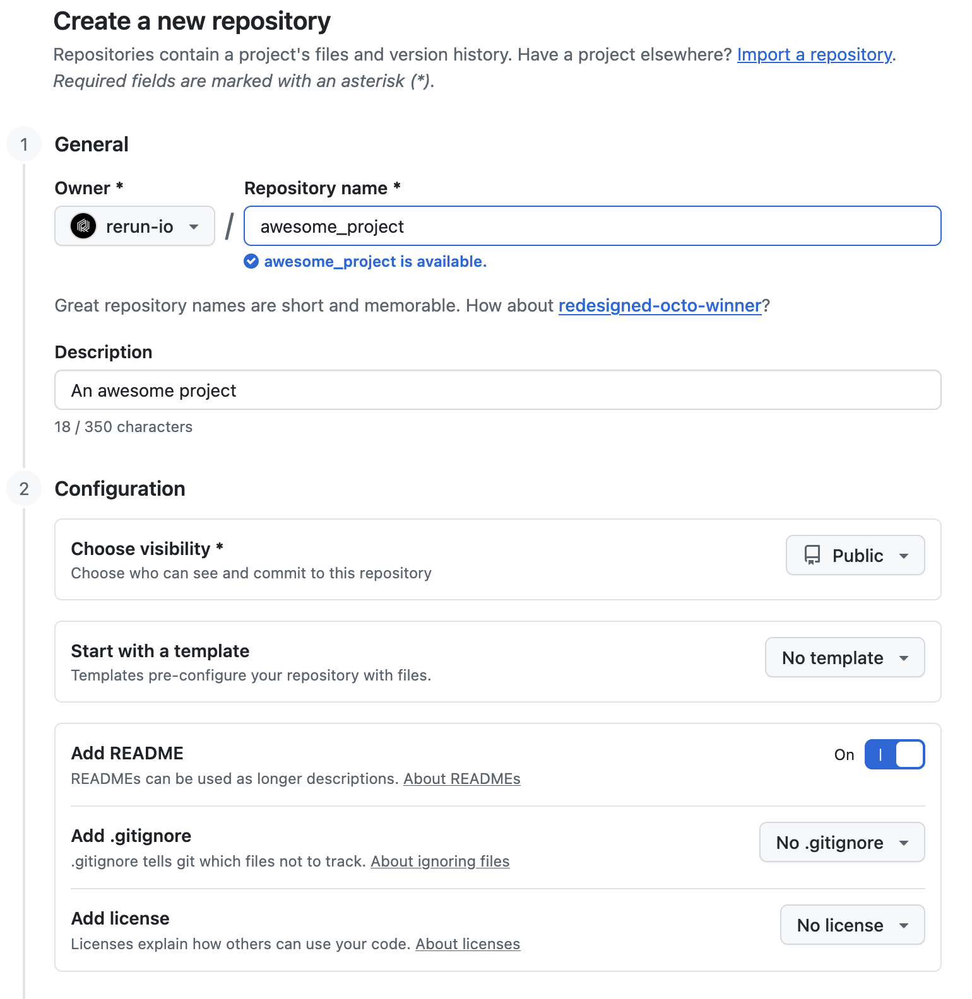
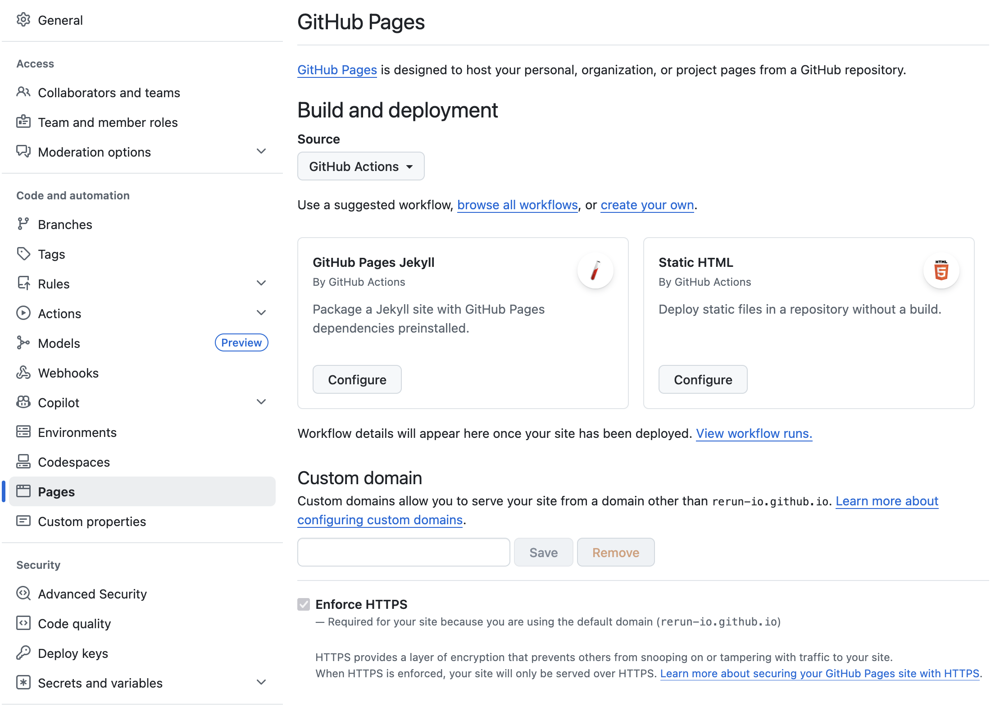

# How to embed Rerun in your webpage

<picture>
 
</picture>

## Used Rerun types

[`Points3D`](https://rerun.io/docs/reference/types/archetypes/points3d), [`LineStrips3D`](https://rerun.io/docs/reference/types/archetypes/line_strips3d), [`Transform3D`](https://www.rerun.io/docs/reference/types/archetypes/transform3d)

## Overview

Static screenshots and videos belong in the past. In this guide, we will walk through deploying a live, interactive webpage integrated with Rerun. By embedding a hosted Rerun viewer, you are not just showing your results — you are handing your audience the keys to explore your data in 3D, scrub through timelines, and inspect your model's logic in real-time.

In a fast-moving industry, the ability to provide an immersive, 'hands-on' demo is the difference between a project that gets glanced at and one that gets remembered. Here we will go through the steps to create your webpage with Rerun integrated, you will see that it is simple and quick process that does not take away valuable development or writing time.

You can see the [resulting webpage here](https://rerun-io.github.io/webpage_example/).

## Useful resources

Below you will find a collection of useful Rerun resources for this example:

* [Embed Rerun in Web pages](https://rerun.io/docs/howto/integrations/embed-web)
* API pages:
  * [Web viewer](https://ref.rerun.io/docs/js/stable/web-viewer/index.html)
  * [React web viewer](https://ref.rerun.io/docs/js/stable/web-viewer-react/index.html)
* Rerun web-viewer examples:
  * [Basic](https://github.com/rerun-io/web-viewer-example)
  * [React](https://github.com/rerun-io/web-viewer-react-example)
  * [Svelte](https://github.com/rerun-io/web-viewer-svelte-example)
  * [Serve](https://github.com/rerun-io/web-viewer-serve-example)
  * [Gradio](https://github.com/rerun-io/gradio-rerun-viewer)

---

## How-to guide

This guide goes from nothing to a complete live webpage hosted via [GitHub Pages](https://docs.github.com/en/pages). We assume you are running all commands within the `webpage_example` repository folder and using the [Pixi](https://pixi.sh/latest/#installation) package manager for environment setup (only needed if you want to generate the recordings dataset yourself). To build and host the webpage locally we make use of [npm](https://docs.npmjs.com/downloading-and-installing-node-js-and-npm).

<!-- Here we will go from nothing to having a complete webpage. We will utilize Github pages to host the webpage. Using Github pages is common, as it allows you to boundle your webpage together with the project and source code itself. -->

### 1. Preparing the data (`.rrd` and `.rbl` files)

The first thing you need is data. Record your streams (point clouds, images, transforms) and save them as an `.rrd` file. For this example, we will use the [getting started guide](https://rerun.io/docs/getting-started/data-in/python) to produce our data. We have prepared the code in the file `webpage_example/create_dataset.py`. To save the data to a file, instead of logging it to the Rerun viewer, we call the [`rerun.save`](https://ref.rerun.io/docs/python/stable/common/initialization_functions/#rerun.save) before logging any of the data. You can also [use `Save recording...` from the file menu](https://rerun.io/docs/getting-started/data-out/export-dataframe#load-the-recording) to save the `.rrd` file from the Rerun viewer.

Second we want to setup the blueprint, to configure what the user will be seeing in the Rerun viewer when opening the page. If you want, you can add the blueprint directly to the `.rrd` file we created in the first step. The benefit of separating them is that you can update the blueprint separately without having to regenerate the `.rrd` file. In this example, the generating of the `.rrd` is quick and the file is small, but perhaps your data is larger which means it will take longer for you to produce and upload the `.rrd` file, compared to updating and uploading the blueprint (`.rbl`) file, which is typically much smaller.

The `.rbl` file is created by commenting out `rerun.save` from the `webpage_example/create_dataset.py` file and instead run `rr.spawn()`. This will open the viewer and log the data to the viewer. Then we setup the view to our liking and [use `Save blueprint...` from the file menu](https://rerun.io/docs/concepts/visualization/blueprints#2-save-and-load-files).

> For web deployment, keeping file sizes optimized is key for fast loading. Prune your data and keep only what is neccessary to enable a seemless experience.

### 2. Hosting the data

The webpage needs to "fetch" the data from somewhere. You can host the data wherever you please. If the data is small enough, you can store it directly in the repository itself. Otherwise, you may use a service, such as Google Drive, OneDrive, or similar to store your data.

In this example, we are hosting the `dna_structure.rrb` and `dna_structure.rbl` in the `recordings` folder of this repository.

<!-- > Potentially talk about cross-origin resource sharing problems. -->

### 3. Create your webpage

Github have great documentation for [GitHub Pages](https://docs.github.com/en/pages), which we recommend you reading. Here we will go through the approach that we took.

#### Create a Github repository

Create a Github repository, it is good to at least have a `README.md` file in the repository.

<picture>
  <source media="(prefers-color-scheme: light)" srcset="media/light/create_repo.png">
  <source media="(prefers-color-scheme: dark)" srcset="media/dark/create_repo.png">
  
</picture>

#### Enable Github pages

Next, we want to enable Github pages. This is done by going to your repository in your browser, go to `Settings` and then select `Pages`. Under `Build and deployment` select `GitHub Actions` as the `Source`.

<picture>
  <source media="(prefers-color-scheme: light)" srcset="media/light/enable_gh_pages.png">
  <source media="(prefers-color-scheme: dark)" srcset="media/dark/enable_gh_pages.png">
  
</picture>

#### Create a Github action workflow

Now we should setup the workflow that deploys are Github pages webpage. Create a file `deploy.yml` inside the `.github/workflows` folder of your Github repository. You may have to create the folders yourself. The contents of the file should be:

```yml
# Simple workflow for deploying static content to GitHub Pages
name: Deploy app to GitHub Pages

on:
  # Runs on pushes targeting the default branch
  push:
    branches: ["main"]

  # Allows you to run this workflow manually from the Actions tab
  workflow_dispatch:

# Sets the GITHUB_TOKEN permissions to allow deployment to GitHub Pages
permissions:
  contents: read
  pages: write
  id-token: write

# Allow one concurrent deployment
concurrency:
  group: "pages"
  cancel-in-progress: true

jobs:
  # Single deploy job since we're just deploying
  deploy:
    environment:
      name: github-pages
      url: ${{ steps.deployment.outputs.page_url }}
    defaults:
      run:
        # The webpage is defined in the docs folder,
        # so we set it as the default
        working-directory: docs
    runs-on: ubuntu-latest
    steps:
      - name: Checkout
        uses: actions/checkout@v6

      - name: Set up Node
        uses: actions/setup-node@v4
        with:
          node-version: 20

      - name: Install dependencies
        run: npm install

      - name: Build
        run: npm run build
        env:
          REPOSITORY: ${{ github.event.repository.name }}

      - name: Setup Pages
        uses: actions/configure-pages@v5

      - name: Upload artifact
        uses: actions/upload-pages-artifact@v3
        with:
          # The folder the action should upload to GitHub Pages.
          # In this example, we are uploading the dist folder inside docs,
          # which is where our static site is built.
          path: "./docs/dist"

      - name: Deploy to GitHub Pages
        id: deployment
        uses: actions/deploy-pages@v4
```

This workflow assumes that the webpage is located in a folder `docs` in the root of our repository, on the `main` branch. You may want to update this as you see fit. It will deploy the website for every push to `main`.

#### Copy the docs folder

Everything related to the webpage in this repository (except for the workflow) has been put into the `docs` folder. To start working on your webpage, you can copy this repository's `docs` folder to your repository. After you have pushed the code, you need to wait for the Github action to finish deploying your webpage. You can see when it has finished by visiting the repository in your web browser.

#### Make the webpage yours

Update the files inside the `docs` folder to reflect on your work. There are mainly four files that you probably want to edit:

* `docs/index.html`
  * Here you fill in the content of your webpage.
* `docs/style.css`
  * Here you configure the style of your webpage. The supplied style supports both light and dark theme, and will switch between them based on the browsers/systems settings.
* `docs/src/main.ts`
  * Here is where we create the interactive Rerun viewer on the webpage. You most likely would want to change the variables `rrd` and `rbl` to point to your own files.
* `docs/package.json`
  * Make sure to sync the Rerun version you use to generate the `.rrb` and `.rbl` files with the version of the version of `@rerun-io/web-viewer` specified in this file.

You probably also want to upload your own assets (images, videos, icons), to the `docs/assets` folder and use them inside `docs/index.html`.

Unless you want to do something more advanced, you can probably leave the other files inside the `docs` folder as they are. Changes to those files are out-of-scope for this example.

#### Wait for deployment

After you have pushed your code, you need to wait for the Github action to finish deploying your webpage. You can see when it has finished by visiting the repository in your web browser.

#### Access your site

You will be able to access your site at: [https://your-username.github.io/your-repo-name](https://your-username.github.io/your-repo-name), replace `your-username` with your Github username and `your-repo-name` with the name of the repository you created.

## Test your page locally

You can test your page locally by cloning the repo and running:

```sh
cd docs
npm install
npm run dev
```

and then open the link that is printed.

In this repository we have also made a Pixi task so you can run:

```sh
 pixi run host_webpage
```

and it will run those commands for you.

## Things to look out for

1. Make sure to keep the data files (`.rrd` and `.rbl`) at the same version as the `@rerun-io/web-viewer` version specified in `docs/package.json`. In this example repo, that means that the `rerun-sdk` version specified in `pyproject.toml`, when generating the data, is the same as the `@rerun-io/web-viewer` version specified in `docs/package.json`, when viewing the data.
